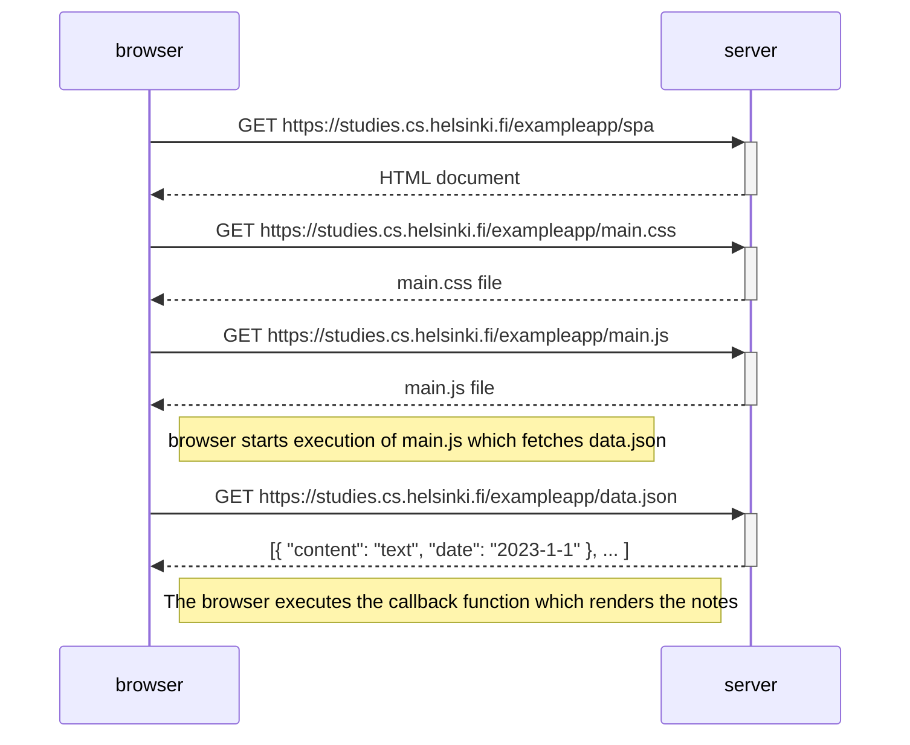

# Visiting Single Page Application

```mermaid
sequenceDiagram
    participant B as browser
    participant S as server
    
    B->>+S: GET https://studies.cs.helsinki.fi/exampleapp/spa
    S-->>-B: HTML document
    
    B->>+S: GET https://studies.cs.helsinki.fi/exampleapp/main.css
    S-->>-B: main.css file
    
    B->>+S: GET https://studies.cs.helsinki.fi/exampleapp/main.js
    S-->>-B: main.js file
    
    Note right of B: browser starts execution of main.js which fetches data.json
    
    B->>+S: GET https://studies.cs.helsinki.fi/exampleapp/data.json
    S-->>-B: [{ "content": "text", "date": "2023-1-1" }, ... ]    

    Note right of B: The browser executes the callback function which renders the notes 
```
