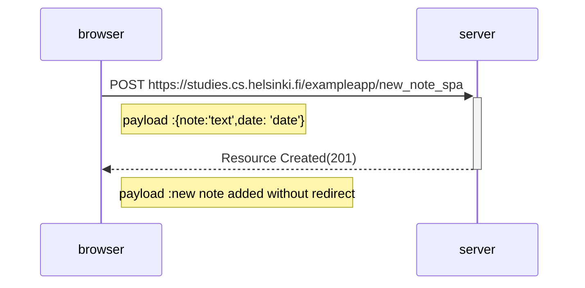

# New Note Creation on single page app

```mermaid
sequenceDiagram
    participant B as browser
    participant S as server
  
    B->>+S: POST https://studies.cs.helsinki.fi/exampleapp/new_note_spa
    Note right of B: payload :{note:'text',date: 'date'}
    S-->>-B: Resource Created(201)
    Note right of B: payload :new note added without redirect
```
